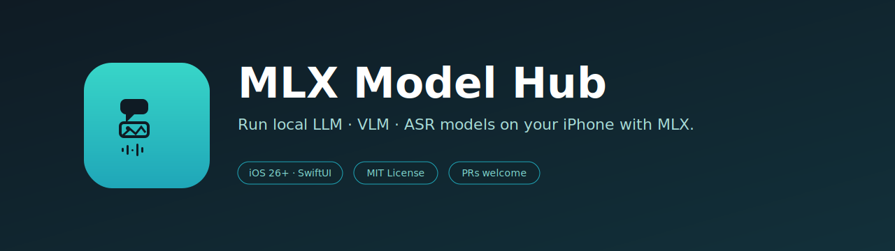
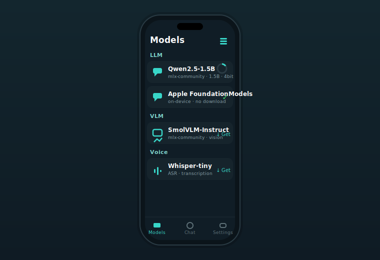

<p align="center">
  
</p>

<h1 align="center">MLX Model Hub</h1>

<p align="center">
  <strong>Run local LLM · VLM · ASR models on your iPhone with MLX.</strong><br/>
  A SwiftUI iOS/iPadOS app that searches, downloads, and switches between on-device models — language, vision, and audio — powered by Apple <a href="https://github.com/ml-explore/mlx-swift-examples">MLX</a> and Apple FoundationModels.
</p>

<p align="center">
  
  
  
  
  
  <a href="https://github.com/akidon0000/mlx-model-hub/actions/workflows/ci.yml"></a>
</p>

<p align="center">
  <a href="README.md">English</a> ·
  <a href="README.ja.md">日本語</a>
</p>

---

<p align="center">
  
</p>

## ✨ Why?

Apple Silicon iPhones can run surprisingly capable models entirely on-device, but wiring up MLX, downloading weights from Hugging Face, and juggling multiple modalities is fiddly. **MLX Model Hub** is a single app that does all of it: browse a catalog, tap to download from `mlx-community`, load, and run inference — for text (LLM), images (VLM), and speech (ASR) — and fall back to Apple's built-in FoundationModels where available. Everything runs locally; nothing leaves the device.

## 🚀 Features

- 🧩 **Multi-modal** — language (LLM), vision (VLM), and audio (ASR) in one app.
- 🔀 **Switch models on the fly** — pick from a catalog; download → load → infer.
- ⬇️ **In-app downloads** — fetched automatically from Hugging Face Hub (`mlx-community`).
- 🍎 **FoundationModels** — use Apple's on-device LLM with no download on supported devices.
- 🧮 **Smart size estimates** — parameters × quantization bits, since the HF list API can't expand storage.
- 🧪 **Testable core** — pure heuristics and a mock model service keep unit tests network-free.

## 🧰 Requirements

- iOS **26.0+** on a physical Apple Silicon device (MLX uses the GPU/Neural Engine; the simulator is limited).
- Xcode **26.3+** (Xcode 27 also works), Swift **6.0**.
- [XcodeGen](https://github.com/yonaskolb/XcodeGen) to generate the project from `project.yml`.

## 📦 Setup

```bash
git clone https://github.com/akidon0000/mlx-model-hub.git
cd mlx-model-hub

brew install xcodegen   # if not installed
make generate           # project.yml → MLXModelHub.xcodeproj
open MLXModelHub.xcodeproj
```

Set your signing team (`DEVELOPMENT_TEAM`) in Xcode, then run on a real device.

> [!NOTE]
> `mlx-swift-examples` is pinned to `exactVersion: 2.29.1` on purpose — `main` is mid-refactor and doesn't expose the `MLXLLM` / `MLXVLM` products yet. Models are cached under `Caches/models/<repo>` (the same location as MLX's `defaultHubApi`).

### Dev loop

```bash
make build   # build for the iOS simulator
make test    # run unit tests
make ci      # generate → build → test (same as CI)
```

## 🏗 Architecture

```
Sources/
  App/         App entry · Info.plist
  Models/      Modality · ModelDescriptor · ModelCatalog · ModelStore ·
               HFModelService (live search) · MockModelService (preview/tests) ·
               ModelHeuristics (pure: quantization/params/size) · SortOption
  Download/    LocalModelStorage · DownloadState
  Inference/   Language (MLXLLM) · Vision (MLXVLM) · Audio (stub) · FoundationModels
  Views/       RootView · ChatView · CameraView · AudioView · ModelListView · ModelRow
Tests/         Swift Testing (logic unit tests)
```

- State lives in `@MainActor @Observable ModelStore` (search, download/load state, active model).
- Search goes through a `ModelSearching` protocol — live `HFModelService`, or network-free `MockModelService` for previews/tests.
- Estimation logic is concentrated in the side-effect-free `ModelHeuristics`.

## ➕ Adding a model

Add one `ModelDescriptor` to [`Sources/Models/ModelCatalog.swift`](Sources/Models/ModelCatalog.swift) and it shows up in the list and becomes downloadable. `id` is the Hugging Face repo id.

## 🗺 Roadmap / Known gaps

- Real audio (Whisper) inference is not wired up yet — `AudioEngine` is a stub pending WhisperKit integration.
- `mlx-swift-examples` APIs move fast; `generate` / `loadContainer` signatures may need to track the pinned version.
- Increased Memory Limit entitlement for larger models on device.

## 🤝 Contributing

PRs welcome! See [CONTRIBUTING.md](CONTRIBUTING.md) for the dev loop, coding conventions, and the PR checklist.

## 📄 License

[MIT](LICENSE) © akidon0000
